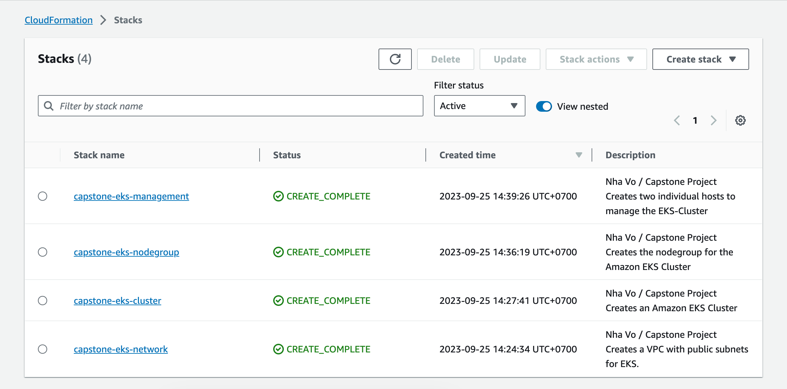
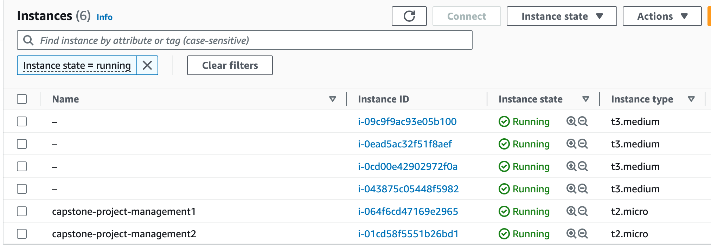
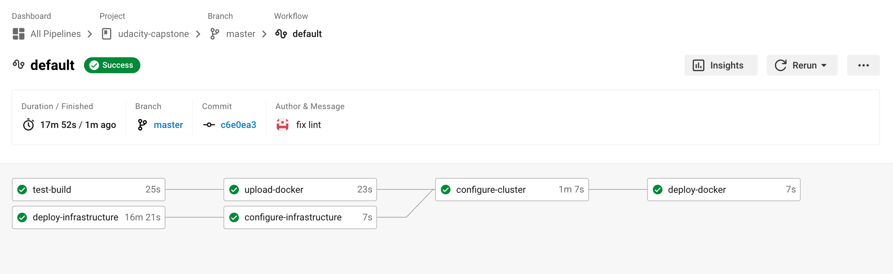
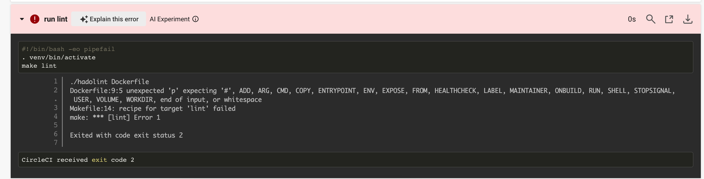
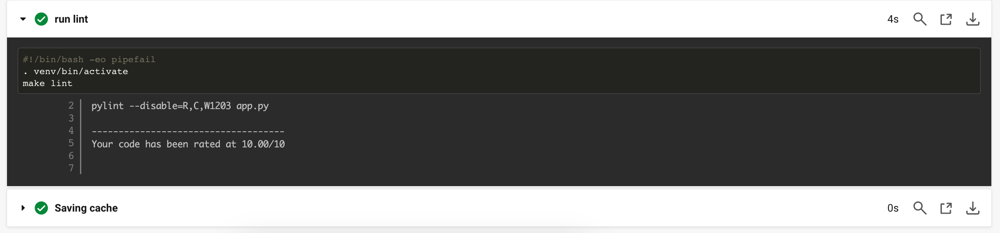
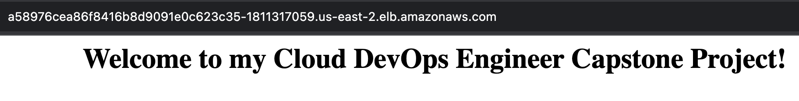

# Cloud DevOps Engineer Capstone Project

This project signifies the triumphant culmination of my final Capstone project and the successful conclusion of the Cloud DevOps Engineer Nanodegree program at Udacity.

## What did I learn?

In this project, I harnessed the expertise and insights I cultivated during the Cloud DevOps Nanodegree program. This encompassed a spectrum of proficiencies, such as:
- Leveraging Circle CI to orchestrate Continuous Integration and Continuous Deployment workflows.
- Constructing robust pipelines for streamlined development and deployment.
- Proficiently wielding Ansible and CloudFormation for the deployment of resilient clusters.
- Mastering the art of crafting Kubernetes clusters with precision.
- Seamlessly integrating Docker containerization into the pipeline process.
- Navigating the AWS ecosystem with dexterity and proficiency.

## Application

The Application is based on a python3 script using <a target="_blank" href="https://flask.palletsprojects.com">flask</a> to render a simple webpage in the user's browser.
A requirements.txt is used to ensure that all needed dependencies come along with the Application.

## Kubernetes Cluster
I utilized AWS CloudFormation to orchestrate the deployment of the Kubernetes Cluster. The CloudFormation deployment can be dissected into four distinct phases.
- Networking to establish seamless communication between new nodes and the cluster.
- The Kubernetes Cluster is created using Elastic Kubernetes Service (EKS)
- NodeGroups play a crucial role, each equipped with a specific set of rules dictating how instances are operated and created within the EKS cluster.
- Management is imperative for configuring and overseeing the cluster, along with its deployments and services
### List of deployed Stacks:

### List of deployed Instances:

## CircleCi - CI/CD Pipelines
I used CircleCi to create a CI/CD Pipeline to test and deploy changes manually before they get deployed automatically to the Cluster using Ansible.

## Linting using Pylint and Hadolint
Linting is used to check if the Application and Dockerfile is syntactically correct. This process makes sure that the code quality is always as good as possible.

### This is the output when the step fails:

### This is the output when the step passes:

## Access the Application
After the EKS-Cluster has been successfully configured using Ansible within the CI/CD Pipeline, I checked the deployment and service as follows:

Public LB DNS: http://a58976cea86f8416b8d9091e0c623c35-1811317059.us-east-2.elb.amazonaws.com/

Github repo: https://github.com/vtnha88/udacity-capstone
